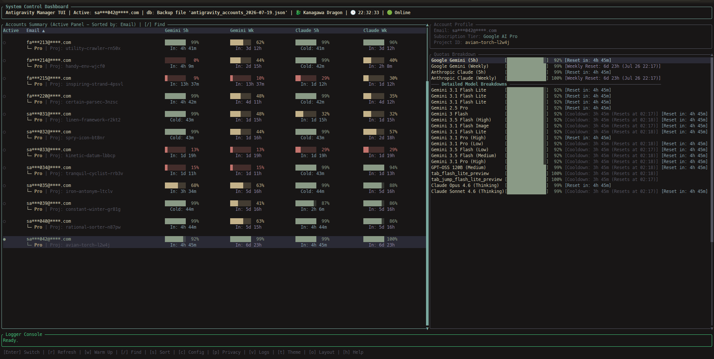

# Antigravity Manager TUI (`agm`)

[](https://github.com/fhrrrzy/antigravity-manager-tui/releases/latest)
[](LICENSE)
[](https://www.rust-lang.org/)
[-brightgreen?style=flat-square)](https://github.com/fhrrrzy/antigravity-manager-tui/releases)

A high-performance command-line utility and terminal user interface (TUI) written in Rust to manage accounts, monitor Google Companion API quotas, and coordinate smart session warmups for the Antigravity system. 



It provides seamless integration for developer workflows, supporting both an interactive dashboard for manual operations and a scriptable CLI for background automation.

---

## Quick Install

```bash
curl -fsSL https://raw.githubusercontent.com/fhrrrzy/antigravity-manager-tui/main/install-quick.sh | bash
```

Or download a pre-built binary directly from the [latest release](https://github.com/fhrrrzy/antigravity-manager-tui/releases/latest).

---

## Table of Contents
- [About the Project](#about-the-project)
- [Key Features](#key-features)
- [Getting Started](#getting-started)
  - [Prerequisites](#prerequisites)
  - [Installation and Setup](#installation-and-setup)
- [Usage](#usage)
  - [TUI Mode](#tui-mode)
  - [CLI Mode](#cli-mode)
- [Configuration and Database](#configuration-and-database)
- [Acknowledgments](#acknowledgments)
- [License](#license)

---

## About the Project

This utility acts as a central control plane for managing account pools utilized by the Antigravity CLI and IDE companion tools. By interfacing directly with Google's backend APIs, it checks usage quotas, rotates credentials into system keyrings, and schedules model warmups to maintain uninterrupted access.

---

## Key Features

- **System Keyring Integration**: Instantly switch the active developer session. Credentials are automatically written to your system's keyring (Linux Secret Service, macOS Keychain) and exported to workspace token files for IDE integration.
- **Interactive TUI Dashboard**: Built with `ratatui` for responsive navigation, visual quota progression bars, and interactive logging history overlays.
- **Flexible Sorting**: Sort your account pool by email, Gemini 5h/weekly quotas, or Claude 5h/weekly quotas. Accessible via column-header clicks or a dedicated keyboard sorting menu.
- **Background Async Worker Pool**: Operations (e.g., token refreshes, network calls, warmup requests) run concurrently in background tokio tasks to keep the interface completely smooth and non-blocking.
- **Smart Cooldown Warmup**: Automates model warmup triggers for exhausted/cooled-down slots while enforcing a strict 4-hour safety cooldown per model.
- **Backup & Restore**: Create and restore local JSON database snapshots directly from the TUI or command line.

---

## Getting Started

### Prerequisites

#### Linux (Ubuntu/Debian)
```bash
sudo apt update && sudo apt install git build-essential -y
curl --proto '=https' --tlsv1.2 -sSf https://sh.rustup.rs | sh
```

#### Android (Termux)
```bash
pkg update && pkg install git rust clang -y
```

### Installation and Setup

1. **Clone the Repository**:
   ```bash
   git clone git@github.com:fhrrrzy/antigravity-manager-tui.git ~/antigravity-manager-tui
   cd ~/antigravity-manager-tui
   ```

2. **Run the Installer**:
   An installer script is provided to compile the optimized binary and register the path with your shell profiles:
   ```bash
   ./install.sh
   ```
   *Note: On Termux, the binary is copied directly to `$PREFIX/bin/agm`. On Desktop Linux/macOS, it is placed in `~/.local/bin/agm` and appended to your active shell configuration (`.bashrc`, `.zshrc`, etc.) if not already present.*

---

## Usage

### TUI Mode

Launch the TUI interface by running the utility with no arguments:
```bash
agm
```

#### Keyboard Controls
- **`Tab`**: Switch focus between the Accounts Table and the Quotas Breakdown panel.
- **`↑` / `↓` (or `k` / `j`)**: Scroll through items in the focused panel.
- **`Enter`**: Activate the selected account (refreshes credentials and updates system keychains).
- **`r`**: Refresh quotas for the selected account from Google APIs.
- **`R`**: Trigger an asynchronous batch refresh of all accounts' quotas.
- **`w`**: Run a smart warmup cycle for the selected account.
- **`W`**: Run a batch smart warmup cycle for all accounts.
- **`f`**: Force warm up all models for the selected account (ignores cooldowns).
- **`s`**: Open the keyboard-driven Sort Mode Selector menu.
- **`/`**: Search/filter accounts by email address.
- **`c`**: Toggle compact view mode (hides reset timers).
- **`v`**: View detailed background worker execution logs.
- **`t`**: Toggle color theme palette selector.
- **`b`**: Create a local database backup JSON snapshot.
- **`Esc` / `q`**: Close modal overlays or exit the application.

#### Mouse Support
You can click on any row in the Accounts Table to highlight it. Clicking on table column headers (`Email`, `Gemini`, `Claude`) cycles sorting modes and directions.

---

### CLI Mode

Execute operations directly from your command line or run automation scripts:

```bash
# List all configured accounts and their current status
agm list

# Switch the active account by index or email
agm switch <INDEX_OR_EMAIL>

# Perform an automated rotation to the healthiest account in the pool
agm auto-switch

# Query cached quota data for the active account
agm quota

# Refresh and query live quota data from Google APIs
agm quota --refresh

# Run a smart warmup cycle for cooled-down models
agm warmup

# Force a warmup cycle for a specific model
agm warmup --model gemini-3-flash --force

# Backup the local database
agm backup
```

---

## Configuration and Database

The utility stores configuration files, cached quotas, and warmup histories locally:
* **Linux Path**: `~/.antigravity_tools/`
* **Termux Path**: `/data/data/com.termux/files/home/.antigravity_tools/`

Key Files:
- `accounts.json`: Local database listing emails, display names, and credentials.
- `accounts/*.json`: Individual account details (synced with desktop configs).
- `cli_cache.json`: Cache for active session emails, validation tokens, and fetched quotas.
- `warmup_history.json`: Historical record of model warmups used to calculate cooldown thresholds.

---

## Acknowledgments

This tool builds upon and extends the core concepts and original workflows of the [lbjlaq/Antigravity-Manager](https://github.com/lbjlaq/Antigravity-Manager) project.

---

## License

This project is licensed under the [MIT License](LICENSE) (or alternative terms of the repository). Refer to the license file for details.
